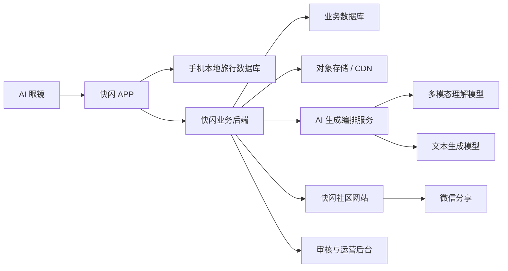

# 快闪 AI 游记与社区系统需求说明书

| 项目 | 内容 |
|---|---|
| 文档版本 | V1.0 |
| 文档状态 | 需求初稿，供产品、设计、开发、测试和部署评审 |
| 编制日期 | 2026-07-24 |
| 现有产品基线 | 快闪 Android APP 0.8.2（包名保持 `com.noah.glassesjourney`） |
| 现有后端基线 | Noah Backend 0.2.x：地点、天气、阿里云语音令牌 |
| 新系统名称 | 快闪 AI 游记与社区系统 |

## 1. 文档目的

本说明书定义“快闪”在现有 AI 眼镜旅行记录能力之上，新增 AI 游记/日记生成、APP 内展示、社区网站展示、发布权限控制及微信分享能力的完整系统需求。

本文档用于：

- 明确产品边界、业务流程和第一版交付范围；
- 指导 Android、后端、AI、社区网站、管理后台和测试工作；
- 保证新增能力不破坏现有眼镜连接、拍照、录像、同步、地点天气和语音感悟功能；
- 统一数据模型、接口、隐私、安全和验收标准。

## 2. 项目背景

### 2.1 现有系统能力

现有“快闪”APP 已具备：

1. 连接 AI 眼镜并显示连接状态、电量和设备信息；
2. 使用眼镜拍照和录像，将媒体同步到手机；
3. 为旅行瞬间记录拍摄时间、经纬度、地点名称和天气；
4. 创建、结束和查看旅行，按时间线组织照片与视频；
5. 为旅行瞬间设置活动小类和自定义分类；
6. 通过眼镜录制语音感悟，使用阿里云 NLS 转写为文字；
7. 在 APP 中编辑地点、文字感悟和旅行瞬间信息；
8. 通过现有后端完成地点解析、天气查询和语音令牌获取。

### 2.2 当前缺口

现有系统尚不具备：

- 用户账号与跨设备身份；
- 旅行数据云同步；
- 照片、视频和音频的云端对象存储；
- 多模态大模型的图片/视频理解和游记生成；
- 游记草稿、编辑、版本和发布管理；
- 社区网站和社区内容流；
- 私密、链接可见、公开等可见范围控制；
- 微信分享链接、分享海报或微信开放平台集成；
- 社区内容审核、举报及运营后台。

## 3. 产品目标与原则

### 3.1 产品目标

用户完成一段旅行后，可以选择旅行中的照片、视频、地点、天气、活动分类和个人感悟，由多模态大模型生成一篇可编辑的游记或日记。用户可以：

- 只保存在自己的 APP 中；
- 生成私密分享链接；
- 主动发布到“快闪社区”网站；
- 分享到微信好友或朋友圈；
- 随时修改、撤回公开或删除内容。

### 3.2 核心原则

1. **默认私密**：新生成内容默认是私密草稿，任何内容不得自动公开。
2. **用户确认后发布**：发布社区、公开地点、公开人物画面和微信分享必须由用户主动确认。
3. **以事实为主**：AI 只能基于真实时间、地点、天气、媒体和感悟组织文字，不得虚构行程、人物或事件。
4. **原始记录不可被 AI 覆盖**：AI 生成内容是派生内容，不得修改照片、视频及原始元数据。
5. **渐进式上传**：历史本地数据不自动上传，只上传用户选择用于生成或发布的内容。
6. **兼容现有功能**：现有拍摄、录像、同步、语音和旅行记录流程保持可用；云端或 AI 服务故障时，本地记录仍可使用。
7. **成本可控**：视频默认抽取关键帧分析，不将完整视频直接发送给多模态模型。

## 4. 系统范围

### 4.1 系统组成

系统由以下部分组成：

1. 快闪 Android APP；
2. 快闪业务后端与统一 API；
3. 用户与权限服务；
4. 旅行数据同步服务；
5. 对象存储与 CDN；
6. AI 内容生成编排服务；
7. 快闪社区网站；
8. 内容审核与运营管理后台；
9. 微信分享能力；
10. 外部服务：地图、天气、语音识别、多模态模型、文本大模型。

### 4.2 总体业务关系



### 4.3 不在第一版范围内

- AI 自动发布内容；
- 自动上传全部历史照片和视频；
- 实时聊天、私信、直播；
- 完整推荐算法和广告系统；
- 将完整长视频直接交给大模型分析；
- 自动识别人脸身份；
- AI 自动修改原始地点、时间和天气数据。

## 5. 用户角色

| 角色 | 权限说明 |
|---|---|
| 游客 | 浏览公开社区内容、打开分享链接 |
| 注册用户 | 云同步自己的旅行、生成和编辑游记、控制发布范围、分享内容 |
| 内容作者 | 发布、更新、撤回和删除自己的公开游记 |
| 社区用户（后续） | 点赞、收藏、评论、关注；第一版可暂不实现 |
| 审核员/运营人员 | 查看审核队列、处理举报、下架违规内容、管理专题 |
| 系统管理员 | 用户、权限、模型配置、服务配置、配额和审计管理 |

## 6. 核心业务流程

### 6.1 生成游记/日记

1. 用户进入某次已结束或进行中的旅行详情；
2. 点击“生成游记/日记”；
3. 系统默认选择该旅行中已同步完成的媒体和绑定信息；
4. 用户可取消某些照片、视频或感悟，不参与生成；
5. 用户选择文体、语气、长度和标题偏好；
6. APP 将需要的结构化数据提交后端，并上传尚未上云的选中媒体；
7. 后端创建异步生成任务；
8. AI 服务分析图片；对视频抽取关键帧、时长和已有感悟/转写文本；
9. AI 将旅行按时间和地点组织为游记或日记草稿；
10. APP 展示生成进度，完成后进入草稿编辑页；
11. 用户修改文字、封面、媒体顺序、标题和公开范围；
12. 用户保存私密草稿、发布社区或进行分享。

### 6.2 发布到社区

1. 用户在游记详情或编辑页点击“发布到社区”；
2. 系统展示发布预览和隐私设置；
3. 用户分别设置地点精度、是否展示天气、是否展示个人感悟和是否展示原视频；
4. 系统执行文本与媒体安全检查；
5. 审核通过后生成社区文章；需要人工复核时显示“审核中”；
6. 发布成功后返回社区文章地址；
7. 用户可随时撤回公开，撤回后社区不可见，但个人草稿继续保留。

### 6.3 微信分享

第一版支持两种分享方式：

1. 调用 Android 系统分享面板，将标题、摘要、封面或分享链接发送到微信；
2. 生成带二维码的分享海报，用户保存或分享到微信。

增强版可接入微信开放平台，实现规范的网页卡片、微信登录和分享回调。增强版需单独申请微信开放平台应用，并配置应用签名、包名、域名及 AppID。

## 7. 功能需求

优先级定义：P0 为首版必须，P1 为重要增强，P2 为后续能力。

### 7.1 APP 端需求

| 编号 | 优先级 | 需求 |
|---|---|---|
| APP-J01 | P0 | 在旅行详情页增加“生成游记/日记”入口，不影响原旅行时间线和媒体查看功能。 |
| APP-J02 | P0 | 生成前允许选择照片、视频、语音感悟、手写感悟和结构化信息。 |
| APP-J03 | P0 | 支持“游记”和“日记”两种文体。游记偏时间线和地点叙述；日记偏第一人称感受。 |
| APP-J04 | P0 | 支持简短、标准、详细三种篇幅，支持纪实、温暖、轻松三种基础语气。 |
| APP-J05 | P0 | 显示上传、分析、生成、审核和完成等任务状态，允许失败后重试。 |
| APP-J06 | P0 | 提供草稿编辑页，可编辑标题、摘要、正文段落、图片说明、封面和媒体顺序。 |
| APP-J07 | P0 | AI 文本必须可全文修改，用户修改内容不得在重新打开后丢失。 |
| APP-J08 | P0 | 提供“我的游记”，区分草稿、私密、链接可见、已公开、审核中和已下架。 |
| APP-J09 | P0 | 公开前显示预览和隐私确认，默认不展示精确经纬度。 |
| APP-J10 | P0 | 支持发布、撤回公开、删除、重新生成和复制一份。 |
| APP-J11 | P0 | 支持 Android 系统分享及分享海报。 |
| APP-J12 | P0 | 断网时可继续浏览已缓存的个人游记；生成和发布进入待重试状态。 |
| APP-J13 | P1 | 支持对单一旅行瞬间生成“瞬间日记”。 |
| APP-J14 | P1 | 支持用户保存常用文风和长度偏好。 |
| APP-J15 | P2 | 支持多篇游记合并为月度/年度旅行回忆。 |

### 7.2 旅行数据云同步

| 编号 | 优先级 | 需求 |
|---|---|---|
| SYNC-01 | P0 | 用户登录后，为本地 trip、moment、reflection 建立稳定云端 ID 映射。 |
| SYNC-02 | P0 | 仅上传用户明确选中的旅行和媒体，不默认扫描上传全部历史数据。 |
| SYNC-03 | P0 | 上传支持断点续传、校验、失败重试和幂等，重复提交不得产生重复媒体。 |
| SYNC-04 | P0 | 保留原始拍摄时间、媒体类型、地点、天气、分类和感悟来源。 |
| SYNC-05 | P0 | 本地原文件删除前必须明确提示云端状态；云端删除也需二次确认。 |
| SYNC-06 | P1 | 支持多设备同步和冲突提示，以用户最后确认版本为准。 |

### 7.3 AI 生成需求

| 编号 | 优先级 | 需求 |
|---|---|---|
| AI-01 | P0 | 多模态模型应理解照片内容，并结合时间、地点、天气、活动分类和感悟生成文本。 |
| AI-02 | P0 | 视频默认按场景变化与时间间隔抽取 3～8 张关键帧；较长视频可提高上限但须受成本配置控制。 |
| AI-03 | P0 | 优先使用用户语音转写和手写感悟表达情绪，不得擅自改变用户原意。 |
| AI-04 | P0 | 输出必须为结构化 JSON，包含标题、摘要、正文段落、关联瞬间、图片说明和标签。 |
| AI-05 | P0 | 每个正文段落应记录其依据的 momentId，便于回溯事实来源。 |
| AI-06 | P0 | 对缺失或不确定信息使用模糊表达或省略，不得虚构地点、人物、交通方式和事件。 |
| AI-07 | P0 | 支持重新生成全文、重新生成单段和仅润色文字。 |
| AI-08 | P0 | 同一请求使用幂等键，网络重试不得重复扣费或生成多个任务。 |
| AI-09 | P0 | 模型调用失败、超时、限流或内容不合规时返回可理解的错误和重试建议。 |
| AI-10 | P1 | 支持用户个人写作风格模板，但不得未经授权训练或跨用户混用私人内容。 |

### 7.4 游记内容管理

| 编号 | 优先级 | 需求 |
|---|---|---|
| JRN-01 | P0 | 游记包含标题、封面、摘要、正文、媒体、标签、作者、创建时间和更新时间。 |
| JRN-02 | P0 | 保存 AI 原始版本和用户当前版本，支持查看生成来源和最近编辑时间。 |
| JRN-03 | P0 | 正文段落可关联一个或多个旅行瞬间。 |
| JRN-04 | P0 | 游记删除采用软删除并提供短期恢复能力；彻底删除后清理无引用媒体。 |
| JRN-05 | P1 | 支持模板：时间线、照片故事、短日记、城市漫游。 |
| JRN-06 | P1 | 支持导出长图或 PDF。 |

### 7.5 社区网站需求

| 编号 | 优先级 | 需求 |
|---|---|---|
| WEB-01 | P0 | 提供响应式社区首页，在手机和电脑浏览器正常展示。 |
| WEB-02 | P0 | 首页显示公开游记卡片，包括封面、标题、摘要、作者、时间和模糊地点。 |
| WEB-03 | P0 | 提供游记详情页，按作者确认的顺序展示文字、照片和视频。 |
| WEB-04 | P0 | 游客可访问公开内容；私密内容不可通过猜测 URL 访问。 |
| WEB-05 | P0 | “链接可见”内容只有持有高强度分享链接的人可访问，不进入社区列表和搜索。 |
| WEB-06 | P0 | 作者撤回或删除后，社区详情页立即停止公开展示。 |
| WEB-07 | P0 | 页面提供微信分享引导、复制链接和生成海报能力。 |
| WEB-08 | P1 | 支持按时间、地点、活动类别和标签筛选。 |
| WEB-09 | P1 | 支持作者主页和个人公开游记列表。 |
| WEB-10 | P2 | 支持点赞、收藏、评论、关注和推荐流。 |

### 7.6 发布与可见范围

| 状态 | 可见范围 | 进入社区列表 | 可分享链接 |
|---|---|---|---|
| `DRAFT` | 仅作者 | 否 | 否 |
| `PRIVATE` | 仅作者 | 否 | 否 |
| `UNLISTED` | 作者及持有链接者 | 否 | 是 |
| `REVIEWING` | 仅作者和审核员 | 否 | 否 |
| `PUBLIC` | 所有人 | 是 | 是 |
| `REJECTED` | 仅作者 | 否 | 否 |
| `UNPUBLISHED` | 仅作者 | 否 | 原链接失效 |
| `REMOVED` | 仅管理员可审计 | 否 | 否 |

状态规则：

- 新生成游记必须从 `DRAFT` 开始；
- 只有作者可以申请公开、撤回或删除；
- 公开内容修改后，涉及高风险文本或媒体时应重新审核；
- 管理员下架必须记录原因、操作人和时间；
- 分享链接应支持主动失效和重新生成。

### 7.7 内容审核与运营后台

| 编号 | 优先级 | 需求 |
|---|---|---|
| MOD-01 | P0 | 公开前执行文本和图片/视频封面安全检测。 |
| MOD-02 | P0 | 识别身份证、车牌、未成年人、人脸、家庭精确地址等潜在隐私风险并提醒用户。 |
| MOD-03 | P0 | 提供审核队列、通过、拒绝、下架和填写原因能力。 |
| MOD-04 | P0 | 社区详情提供举报入口，后台支持举报处理和审计。 |
| MOD-05 | P0 | 管理员可查询用户、游记、生成任务、模型消耗和错误日志。 |
| MOD-06 | P1 | 支持专题、精选内容和推荐位运营。 |

## 8. AI 输入与输出规范

### 8.1 输入数据

生成任务至少包含：

- `userId`、`tripId`、任务幂等键；
- 文体、篇幅、语气、语言；
- 旅行标题、开始时间、结束时间；
- 按时间排序的瞬间列表；
- 每个瞬间的照片或视频关键帧；
- 拍摄时间、地点名称、城市、模糊坐标、天气、温度；
- 活动分类、手写感悟、语音识别文本；
- 用户明确排除的媒体和敏感信息设置。

### 8.2 视频处理

1. 后端或客户端生成视频缩略图；
2. 后端按场景变化和固定时间间隔抽帧；
3. 去除模糊、黑屏和高度重复帧；
4. 将关键帧、视频时长、拍摄时间和关联感悟交给模型；
5. 原视频只用于用户播放或公开展示，不默认送入模型；
6. 视频上传、转码和模型分析分别记录状态。

### 8.3 建议输出结构

```json
{
  "title": "夏夜里的城市漫步",
  "summary": "一段基于真实旅行瞬间生成的摘要",
  "style": "TRAVELOGUE",
  "coverMomentId": "moment-id",
  "sections": [
    {
      "heading": "抵达",
      "content": "正文内容",
      "sourceMomentIds": ["moment-id-1"],
      "mediaAssetIds": ["asset-id-1"]
    }
  ],
  "tags": ["城市漫步", "夜景"],
  "warnings": []
}
```

### 8.4 防止事实编造

- 系统提示中明确禁止补写输入中不存在的事实；
- 时间、地点、天气以结构化字段为准，不从图片猜测覆盖；
- 图片只能用于描述可见内容，不能推断人物身份和私人关系；
- 当地点只精确到城市时，不得生成具体店铺或景点；
- 对模型输出做地点、时间和数值一致性校验；
- 用户界面标明“AI 生成，发布前请核对”。

## 9. 数据需求

### 9.1 核心数据表

| 数据实体 | 主要字段 |
|---|---|
| `users` | 用户 ID、昵称、头像、状态、创建时间 |
| `user_identities` | 登录方式、第三方身份、绑定状态 |
| `installations` | APP 安装 ID、设备信息、推送令牌 |
| `trips` | 云端旅行 ID、本地 ID、标题、起止时间、所有者、同步状态 |
| `moments` | 瞬间 ID、旅行 ID、时间、地点、天气、分类、备注、媒体类型 |
| `media_assets` | 对象存储键、类型、大小、校验值、缩略图、时长、处理状态 |
| `reflections` | 瞬间 ID、识别文本、音频资源、来源、识别状态 |
| `journal_generation_jobs` | 任务状态、模型、输入版本、错误码、消耗、开始和完成时间 |
| `journals` | 标题、摘要、正文版本、封面、作者、可见性、审核状态 |
| `journal_sections` | 游记 ID、顺序、标题、正文、来源瞬间列表 |
| `journal_media` | 游记 ID、媒体 ID、排序、说明、展示策略 |
| `share_links` | 游记 ID、令牌摘要、有效期、是否已撤销 |
| `content_reviews` | 审核对象、风险、结论、原因、审核人 |
| `reports` | 举报人、对象、原因、状态和处理结果 |
| `audit_logs` | 关键发布、下架、删除、权限和配置操作 |

### 9.2 与现有本地数据兼容

- 保留现有 `TripEntity`、`TravelMomentEntity`、`ReflectionEntity` 的本地字段和使用方式；
- 新增云端映射字段或独立映射表，不直接把现有本地 ID 改为服务端 ID；
- 现有照片路径、视频路径和音频路径继续作为本地缓存来源；
- 已存在的时间、地点、天气、分类和感悟是生成输入，不进行破坏性迁移；
- 数据库升级必须提供 Room migration，不允许清库升级。

## 10. 后端接口需求

现有 `/health`、`/api/v1/location/resolve`、`/api/v1/weather/snapshot`、`/api/v1/asr/token` 必须保持兼容。新增接口建议如下：

| 接口组 | 建议接口 | 用途 |
|---|---|---|
| 账号 | `POST /api/v1/auth/login`、`POST /api/v1/auth/refresh` | 登录与刷新令牌 |
| 上传 | `POST /api/v1/uploads/presign`、`POST /api/v1/uploads/complete` | 获取签名上传地址及确认上传 |
| 同步 | `POST /api/v1/trips/sync`、`GET /api/v1/trips/{id}` | 同步旅行和瞬间 |
| 生成 | `POST /api/v1/journals/generate` | 创建异步生成任务 |
| 任务 | `GET /api/v1/generation-jobs/{id}` | 查询进度和错误 |
| 游记 | `GET/PUT/DELETE /api/v1/journals/{id}` | 查询、编辑和删除 |
| 发布 | `POST /api/v1/journals/{id}/publish` | 申请发布或生成链接 |
| 撤回 | `POST /api/v1/journals/{id}/unpublish` | 撤回公开内容 |
| 社区 | `GET /api/v1/community/posts`、`GET /api/v1/community/posts/{id}` | 社区列表和详情 |
| 分享 | `POST /api/v1/journals/{id}/share-link`、`POST /api/v1/journals/{id}/poster` | 链接和海报 |
| 举报 | `POST /api/v1/reports` | 用户举报 |

接口要求：

- 所有写接口具备用户鉴权、资源归属校验、限流和幂等控制；
- 上传使用短期签名 URL，客户端不得持有对象存储永久密钥；
- 生成任务采用异步状态查询，避免移动端长连接超时；
- API 返回统一 `requestId`、业务错误码和用户可读提示；
- 不在日志中输出 AccessKey Secret、模型密钥、完整令牌和精确私人位置。

## 11. 页面与交互需求

### 11.1 Android 新增页面

1. 生成入口与生成配置页；
2. 媒体/感悟选择页；
3. 上传与 AI 生成进度页；
4. 游记草稿编辑页；
5. 游记详情页；
6. 发布与隐私设置弹窗；
7. 我的游记列表；
8. 社区列表与社区详情；
9. 分享海报预览；
10. 登录、账号和云同步设置页。

### 11.2 社区网站页面

1. 社区首页；
2. 游记详情页；
3. 链接可见内容页；
4. 作者公开主页；
5. 搜索/筛选页（P1）；
6. 举报和内容不可用页；
7. 运营管理后台。

### 11.3 UI 一致性

- 延续当前“快闪”深色科技感视觉体系；
- APP 与社区使用统一 Logo、颜色、字体层级和媒体卡片规范；
- AI 状态要明确区分“待上传、分析中、生成中、可编辑、审核中、已公开”；
- 任何失败状态均提供原因和下一步操作，不只显示技术错误码。

## 12. 非功能需求

### 12.1 性能

- 普通旅行（不超过 20 个瞬间、5 个短视频）首稿目标 90 秒内完成；
- APP 查询任务状态不得阻塞主线程；
- 社区首屏在正常 4G/5G 网络下目标 3 秒内可交互；
- 图片采用多规格缩略图，视频使用流式播放和 CDN；
- 社区列表采用分页或游标加载。

### 12.2 可靠性

- 媒体上传可恢复，生成任务可重试；
- 生成服务异常不影响本地旅行记录；
- 写操作必须幂等；
- 数据库、对象存储和任务状态具备监控和备份；
- 已公开文章不得因 AI 服务临时不可用而无法阅读。

### 12.3 安全

- 所有互联网接口使用 HTTPS；
- 登录令牌短期有效并支持刷新与主动失效；
- 对象存储默认私有，通过签名 URL 或 CDN 鉴权访问；
- 用户只能访问自己的私密旅行、媒体和游记；
- 精确经纬度不得直接进入公开页面源代码；
- 敏感配置只存服务器环境变量或密钥管理系统。

### 12.4 隐私

公开地点支持三级策略：

1. 隐藏地点；
2. 仅展示城市或区域；
3. 展示用户确认后的具体地点。

公开内容默认采用“仅城市/区域”，不得默认显示经纬度、家庭地址或实时位置。用户删除账号时，应提供个人数据导出和删除流程。

### 12.5 可观测性

系统至少记录：

- 上传成功率、失败原因和耗时；
- 生成成功率、模型耗时、令牌/图片消耗和成本；
- 用户编辑率、重新生成率、发布率和撤回率；
- 社区页面访问、分享链接打开和举报数据；
- 外部模型、对象存储、地图、天气和语音服务可用性。

## 13. 部署与兼容要求

### 13.1 后端部署策略

新增功能需要后端，不建议继续把所有业务堆叠在当前单文件服务中。建议：

- 保留现有后端对地点、天气和语音接口的兼容；
- 新增内容服务、AI 任务服务和社区 API，可先作为独立 Node 服务部署；
- 使用现有 Nginx 统一转发 `/noah-api/`，新增接口路径而不是改变原接口；
- AI 任务使用队列或持久化任务表，避免 Node 进程重启后任务丢失；
- 数据库和对象存储先完成备份、权限隔离和测试环境验证，再接入生产。

### 13.2 APP 兼容

- 保持现有 Android 包名，避免安装后成为另一款 APP；
- 升级后保留用户本地旅行和媒体；
- 用户未登录时继续使用现有本地记录功能；
- AI、社区或云同步入口可在服务不可用时隐藏或显示维护提示；
- 新版本上线前必须完成眼镜拍照、录像、停止录像、同步和语音感悟回归测试。

## 14. 第一版验收标准

### 14.1 私密 AI 游记

1. 用户选择一段包含至少 3 张照片、1 个视频和 1 条感悟的旅行；
2. 系统成功上传选中内容并生成草稿；
3. 草稿正确使用原有时间、地点、天气和感悟；
4. 视频通过关键帧参与生成；
5. 用户可修改并保存草稿；
6. 断网重连后可继续查询任务或重试；
7. 未点击发布前，其他用户和社区网站不可访问。

### 14.2 社区发布

1. 用户可将草稿发布为链接可见或公开；
2. 公开文章能在社区首页和详情页正常展示；
3. 页面不展示精确经纬度；
4. 撤回后社区列表和原分享链接不再公开文章；
5. 无权用户不能编辑或删除他人文章；
6. 违规内容可由后台下架并留下审计记录。

### 14.3 微信分享

1. APP 可调用系统分享面板并选择微信；
2. 可生成含封面、标题和二维码的分享海报；
3. 分享链接在微信内置浏览器可正常打开；
4. 私密草稿不可生成公开链接。

## 15. 分阶段实施计划

### 阶段 A：私密 AI 游记闭环（建议优先）

- 账号最小闭环或匿名安装身份升级；
- 对象存储、媒体上传和云端旅行结构；
- 照片理解、视频抽帧、多模态生成；
- APP 生成配置、进度、草稿编辑和“我的游记”；
- 只支持私密保存，不开放社区。

交付目标：验证“真实旅行数据能否稳定生成用户愿意编辑和保存的文章”。

### 阶段 B：社区网站与发布

- 正式账号体系；
- 社区首页、详情页、作者页；
- 私密、链接可见、公开状态；
- 内容审核、撤回和管理后台；
- 对象存储 CDN 和网站性能优化。

### 阶段 C：微信分享

- 系统分享、复制链接和分享海报；
- 微信内置浏览器兼容；
- 视产品需要申请微信开放平台，升级为规范分享卡片和微信登录。

### 阶段 D：社区增强

- 点赞、收藏、评论、关注；
- 个性化文风、推荐流和专题；
- 月度/年度旅行回忆；
- 数据导出、长图和 PDF。

## 16. 风险与对策

| 风险 | 影响 | 对策 |
|---|---|---|
| AI 编造事实 | 损害可信度 | 结构化输入、来源瞬间绑定、输出校验、发布前确认 |
| 视频和图片成本高 | 生成费用不可控 | 视频抽帧、去重、缩略图、任务配额和成本监控 |
| 精确位置泄露 | 用户隐私风险 | 私密默认、公开模糊地点、敏感地点提醒 |
| 历史媒体过多 | 上传慢、占用存储 | 用户选择上传、断点续传、媒体压缩和生命周期策略 |
| 社区违规内容 | 合规与运营风险 | 机审、人工复核、举报、下架和审计 |
| 新后端影响现有服务 | 拍摄元数据补全受影响 | 新旧接口隔离、灰度部署、回滚包和回归测试 |
| 外部模型不可用 | 生成失败 | 超时重试、熔断、备用模型和任务恢复 |

## 17. 待产品确认事项

以下事项不阻塞需求文档，但应在开发前评审确定：

1. 首版登录方式：手机号、微信、邮箱或设备匿名账号升级；
2. 多模态与文本模型供应商，以及单篇成本上限；
3. 对象存储使用阿里云 OSS、腾讯云 COS 或其他 S3 兼容服务；
4. 社区第一版是否需要点赞、收藏和评论；
5. 公开地点默认展示到城市还是区县；
6. 分享链接默认永久有效还是设置有效期；
7. 是否允许公开原视频，或第一版只公开图片和视频封面；
8. 社区使用 APP 原生页面、WebView，还是原生列表加网页详情；
9. 是否需要实名、备案和特定内容合规流程。

## 18. 建议的下一步

1. 以“1 次旅行、3 张照片、1 个短视频、1 条语音感悟”为标准样例冻结输入数据结构；
2. 选择多模态模型、文本模型、对象存储和数据库；
3. 先完成不公开的 AI 游记原型，验证内容质量、耗时和单篇成本；
4. 原型通过后再建设社区、审核和微信分享，避免一次性扩大实施风险；
5. 在所有新增开发中保持现有本地记录链路独立可用。

---

**结论：** 本需求属于“快闪”从本地旅行记录工具升级为“AI 内容创作与社区平台”。后端是必需部分；现有语音识别服务不能替代多模态图生文模型。最稳妥的实施顺序是先做私密 AI 游记闭环，再做社区公开与微信分享。
