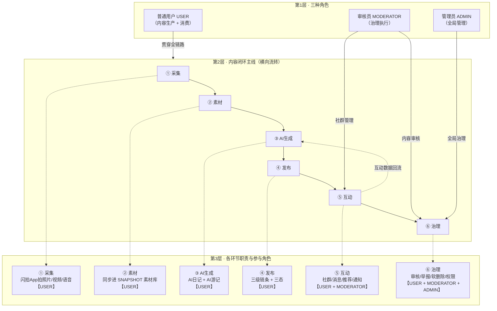

# 徐霞客社区系统框架图

> 三层结构：**三种角色 → 内容闭环主线 → 环节职责下钻**。
> 图例：**实线** = 流转与参与；**虚线** = 下钻展开与数据回流。

## 角色流转速览

| 闭环环节 | 普通用户 USER | 审核员 MODERATOR | 管理员 ADMIN |
|---|---|---|---|
| ① 采集 | 闪拍App拍照片/视频/语音 | — | — |
| ② 素材 | 同步进素材库 | — | — |
| ③ AI生成 | 生成自己的日记/游记 | — | — |
| ④ 发布 | 发布内容（草稿/私密/公开） | — | — |
| ⑤ 互动 | 发动态/聊天/挑战/被推荐 | 版主管理社群（角色/公告） | — |
| ⑥ 治理 | 内容待审、举报他人 | 内容审核、处理举报 | 用户管理、角色分配、封禁 |

**一句话**：USER 贯穿全链路（生产+消费），MODERATOR 聚焦互动管理 + 治理，ADMIN 聚焦全局治理；互动数据经「回流」反哺 AI 生成，治理横切贯穿内容全生命周期。
