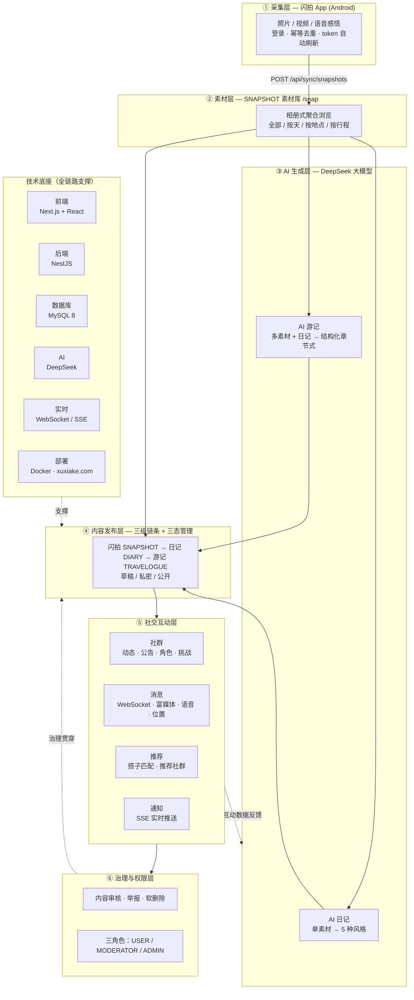

# 徐霞客社区系统框架图

> 以「内容闭环主线」为主轴，功能模块与技术支撑综合呈现。
> 图例：**实线** = 内容/数据主流程；**虚线** = 反馈回流与支撑关系。

## 六环节解读

| 环节 | 职责 | 关键技术 |
|---|---|---|
| ① 采集层 | 闪拍 App 采集旅行瞬间，登录后同步进社区 | Android · `POST /api/sync/snapshots`（幂等） |
| ② 素材层 | SNAPSHOT 素材统一入库、相册式聚合浏览 | `POST /api/upload/{image,video,audio}` · sharp 缩略图 |
| ③ AI 生成层 | 素材升华为高质量内容（日记 / 游记） | DeepSeek · 失败回退本地模板 |
| ④ 内容发布层 | 三级内容链条 + 草稿/私密/公开三态 | Next.js 章节式编辑器 |
| ⑤ 社交互动层 | 社群、消息、推荐、通知四大互动能力 | WebSocket (socket.io) · SSE · 多信号加权推荐 |
| ⑥ 治理与权限层 | 内容审核、举报、软删除、三角色权限 | 敏感词过滤 · deleted_at · USER/MODERATOR/ADMIN |

**闭环说明**：采集 → 素材 → AI 生成 → 发布 → 社交互动 → 互动数据回流至 AI 生成与推荐，形成「内容驱动互动、互动反哺内容」的正向循环；治理层横切贯穿内容全生命周期。
